# Architecture Refactor Program — Dependency-Aware Task Graph (2026-07)

**Status:** Active execution registry  
**Decision record:** [`adr-003-authority-first-refactor-program.md`](adr-003-authority-first-refactor-program.md)  
**Historical backlog:** [`../backlog/2026-07-architecture-review/`](../backlog/2026-07-architecture-review/)  
**Point-in-time evidence date:** 2026-07-15  
**Scope:** Verification, trust/lifecycle boundaries, cross-surface authority, metadata consolidation, hotspot decomposition, and Core/Runtime ownership

## How to use this document

This document is the canonical dependency and status registry for the architecture refactor program. Historical backlog files remain detailed evidence, but their former recommended order is superseded by this graph.

### Status vocabulary

| Status | Meaning |
|---|---|
| `done` | The intended outcome exists on the current tree and its documented gate has passed |
| `partial` | Material work exists, but the intended outcome or gate is incomplete |
| `pending` | The outcome is still required and no complete implementation exists |
| `superseded` | The underlying need remains, but this task's proposed implementation or sequencing is replaced by one or more graph nodes |
| `killed` | The task direction is explicitly rejected; no replacement is required for that direction |

### Execution rules

1. A task may start only when all hard dependencies are `done`.
2. Dashed/support relationships improve safety but do not always block independent preparation.
3. A task is marked `done` only after its exit gate passes on the current tree.
4. Every migration identifies old authority, new authority, compatibility adapter, rollback, and removal gate.
5. Parallel agents coordinate file ownership before editing shared composition roots.
6. Task status changes update this document in the same PR as the status-changing evidence.

## Current baseline summary

The audit established these planning facts:

- The workspace dependency graph is acyclic and package-boundary tests exist.
- Production-source typechecks are broadly healthy, but test-inclusive type checking is inconsistent.
- Root test discovery and dedicated project configurations do not yet form one complete, count-verified manifest.
- TUI has a test-inclusive tsconfig, but the current test contract contains substantial type drift.
- CI build, test, and typecheck jobs do not share one guaranteed clean-build artifact lineage.
- `@wrongstack/webui-server` is already the neutral server package; moving it into Core is not part of this program.
- CLI still owns a second embedded WebUI backend and permissive protocol envelopes.
- ACP file and terminal execution provide the first concrete trust-boundary hardening pilot.
- Plugin loading is not represented as a host-owned disposable lifecycle in CLI shutdown.
- `@wrongstack/runtime` remains a transitional facade; its final ownership is conditional on a successful pilot.
- Current hotspot guardrails do not constitute a complete no-growth ratchet or architecture health system.

Exact measurements are deliberately treated as dated evidence rather than timeless constants. Task `V1` creates the generator that will make future measurements authoritative.

## Program graph

```mermaid
flowchart TD
  subgraph W0[Wave 0 — Verification truth and governance]
    V1["V1 Inventory & verification manifest"]
    V2["V2 Test-inclusive typecheck ratchet"]
    V3["V3 Clean-build CI artifact lineage"]
    V4["V4 Runtime test projects & zero-collection gate"]
    V5["V5 Release / coverage / E2E hardening"]
    G1["G1 Architecture registry, status generator & report"]
    G2["G2 No-growth hotspot ratchet"]
    G3["G3 Exception owner/expiry policy"]
  end

  subgraph W1[Wave 1 — Trust and lifecycle boundaries]
    S1["S1 TrustBoundary contract"]
    S2["S2 ACP filesystem/terminal pilot"]
    S3["S3 WebUI/HQ/Desktop privileged adapters"]
    S4["S4 Legacy session read scrubbing"]
    L1["L1 Disposable plugin host handle"]
    L2["L2 Canonical plugin config lifecycle"]
  end

  subgraph W2[Wave 2 — Cross-surface authority]
    P1["P1 Surface protocol + runtime decoders"]
    P2["P2 Shared connection FSM and projections"]
    P3["P3 Single WebUI backend by handler family"]
    P4["P4 Desktop production cutover"]
    P5["P5 HQ single frontend + recovery shell"]
    P6["P6 SimpleUI projection/state cutover"]
  end

  subgraph W3[Wave 3 — Metadata and public contracts]
    M1["M1 ProviderDefinition registry"]
    M2["M2 Plugin manifest projections"]
    M3["M3 Tool-tier registration authority"]
    M4["M4 ACP v1/SDK contract migration"]
    M5["M5 Security scanner CLI composition"]
  end

  subgraph W4[Wave 4 — Behavioral hotspot decomposition]
    T1["T1 TUI top-level journey harness"]
    T2["T2 TUI key/submit/overlay seams"]
    T3["T3 TUI domain reducers and shell"]
    C1["C1 CLI boot/dispatch journey harness"]
    C2["C2 Shared CLI services"]
    C3["C3 CLI phase composition + shutdown"]
    D1["D1 Multi-agent journey harness"]
    D2["D2 Director-tool/policy contracts"]
    D3["D3 Director lifecycle decomposition"]
  end

  subgraph W5[Wave 5 — Core/Runtime/storage/memory ownership]
    R1["R1 Core export/config ownership ADR"]
    R2["R2 Shared persistence primitive"]
    R3["R3 SuperMemory split + MemoryPort"]
    R4["R4 Runtime subsystem pilot"]
    R5{"R5 Runtime pilot gate"}
    R6["R6 Runtime concrete-owner migration"]
    R7["R7 Fold Runtime facade"]
    R8["R8 Compatibility export retirement"]
  end

  V1 --> V2
  V1 --> V3
  V1 --> V4
  V2 --> V5
  V3 --> V5
  V4 --> V5
  V1 --> G1
  G1 --> G2
  G1 --> G3

  V2 --> S1
  V4 --> S1
  S1 --> S2
  S2 --> S3
  V2 --> S4

  V2 --> L1
  V4 --> L1
  L1 --> L2

  V2 --> P1
  V4 --> P1
  P1 --> P2
  P2 --> P3
  P3 --> P4
  P3 --> P5
  P2 --> P6

  V2 --> M1
  V2 --> M2
  L2 --> M2
  V2 --> M3
  V2 --> M4
  M2 --> M5

  V4 --> T1
  G2 --> T2
  T1 --> T2
  T2 --> T3

  V4 --> C1
  G3 --> C2
  C1 --> C2
  C2 --> C3
  L1 --> C3
  P3 --> C3

  V4 --> D1
  D1 --> D2
  D2 --> D3
  G2 --> D3

  V2 --> R1
  G1 --> R1
  R1 --> R2
  R1 --> R3
  R2 --> R4
  R3 --> R4
  R4 --> R5
  R5 -->|"pilot passes"| R6
  R5 -->|"kill criterion fires"| R7
  R6 --> R8
  R7 --> R8

  G2 -. protects .-> P3
  G2 -. protects .-> T3
  G2 -. protects .-> C3
  G2 -. protects .-> D3
  S1 -. supplies policy .-> P3
  M1 -. feeds setup UI .-> P3
```



## Critical path

The longest mandatory program path is:

```text
V1 → V2/V3/V4 → P1 → P2 → P3 → C3
                         ├→ P4
                         └→ P5

V1 → V2/G1 → R1 → R2/R3 → R4 → R5 → R6 or R7 → R8
```

The highest-risk ordering constraints are:

- `D1` must precede `D2/D3`; realistic orchestration tests are not deferred until after Director splitting.
- `C2` must precede `C3`; CLI phase modules must not inherit business logic from `slash-commands/`.
- `P1 → P2 → P3` is sequential; protocol authority precedes transport and backend cutover.
- `R1 → R4 → R5` precedes broad Core-to-Runtime movement.
- `G2/G3` protect hotspot and compatibility work; governance is not a final cleanup wave.

## Task registry

### Wave 0 — Verification truth and governance

#### V1 — Generate the workspace and verification inventory

- **Status:** `pending`
- **Priority:** P0
- **Hard dependencies:** none
- **Owns:** generated package DAG, publishability, source/test file inventory, tsconfig coverage, test-project expectations
- **Deliverables:** one machine-readable registry plus a human-readable report
- **Exit gate:** the report lists every workspace package and every test file with its owning runtime/typecheck project; counts are stable on two consecutive clean runs
- **Rollback:** generator is additive and can be removed without changing production behavior
- **Historical links:** `008`, `012`, `014`, `017`, `018`, `019`

#### V2 — Establish a test-inclusive TypeScript ratchet

- **Status:** `pending`
- **Priority:** P0
- **Hard dependencies:** `V1`
- **Owns:** generated test tsconfigs and test-type debt baseline
- **Deliverables:** test-inclusive config per package or project group; current-error snapshot; no-new-error ratchet; burn-down plan
- **Exit gate:** every test file belongs to exactly one TypeScript project and the ratchet fails on a newly introduced error
- **Promotion gate:** make the check fully blocking only after existing test-type debt reaches zero
- **Historical links:** `005`, `006`, `013`, `019`

#### V3 — Make CI checks share a clean build lineage

- **Status:** `pending`
- **Priority:** P0
- **Hard dependencies:** `V1`
- **Owns:** build artifacts or source-resolution strategy used by typecheck/test/package smoke
- **Deliverables:** clean build job; artifact upload/download or project-reference alternative; stale-dist prevention
- **Exit gate:** typecheck, test, and package smoke pass from clean checkouts without pre-existing local `dist/`
- **Historical links:** `019`

#### V4 — Define complete runtime test projects and fail on zero collection

- **Status:** `pending`
- **Priority:** P0
- **Hard dependencies:** `V1`
- **Owns:** root/package Vitest project manifest, dedicated environment projects, expected skip budget
- **Deliverables:** coverage for `.test.ts` and `.test.tsx`; dedicated jsdom/HQ project; zero-collection failure; expected/discovered/executed/skipped output
- **Exit gate:** every inventoried test is collected by exactly one expected project and unexpected skips fail CI
- **Historical links:** `005`, `006`, `013`, `019`

#### V5 — Harden release, coverage, benchmark, website, and E2E gates

- **Status:** `pending`
- **Priority:** P1
- **Hard dependencies:** `V2`, `V3`, `V4`
- **Owns:** release matrix rather than product behavior
- **Deliverables:** per-package coverage ratchets; non-tautological Chromium journeys; benchmark config; website ownership decision; explicit publish set; pack/provenance/postinstall smoke
- **Exit gate:** protected release workflow reports artifact manifest and fails on missing coverage/E2E/pack/version gates
- **Historical links:** `005`, `006`, `013`, `019`

#### G1 — Generate architecture status and health from one registry

- **Status:** `pending`
- **Priority:** P0
- **Hard dependencies:** `V1`
- **Owns:** architecture task/status source, measurements, report, dependency visualization
- **Deliverables:** generated largest-files/fan-in/DAG/backlog/exception report; links from contributor docs
- **Exit gate:** this Markdown registry can be regenerated or validated without hand-copying measurements
- **Historical links:** `008` (replacement), `012`, `014`, `017`, `018`

#### G2 — Enforce true no-growth hotspot ratchets

- **Status:** `pending`
- **Priority:** P0
- **Hard dependencies:** `G1`
- **Owns:** current-baseline ceilings for all tracked hotspots
- **Deliverables:** blocking CI check; explicit reviewed baseline-update flow; coverage for TUI reducer/state, WebUI types, CLI WebUI/HQ, Desktop, and SimpleUI
- **Exit gate:** any tracked hotspot growth fails CI unless a reviewed exception changes the baseline
- **Historical links:** `007`, `014`

#### G3 — Enforce temporary exception ownership and expiry

- **Status:** `pending`
- **Priority:** P0
- **Hard dependencies:** `G1`
- **Owns:** slash-import allowlists and other architecture exceptions
- **Deliverables:** owner, reason, issue/task, review date, expiry/removal condition; CI expiry check
- **Exit gate:** no temporary exception exists without complete metadata; expired exceptions fail CI
- **Historical links:** `009`, `016`

### Wave 1 — Trust and lifecycle boundaries

#### S1 — Define the shared TrustBoundary contract

- **Status:** `pending`
- **Priority:** P0
- **Hard dependencies:** `V2`, `V4`
- **Owns:** policy decision only; executors remain surface-specific
- **Deliverables:** actor/surface/capability/subject/risk/scope/auth-context request; allow/deny/confirm/scoped-token result; characterization tests
- **Exit gate:** policy can express ACP, WebUI process, HQ control, and Desktop privileged decisions without generic bypass flags

#### S2 — Pilot TrustBoundary in ACP filesystem and terminal

- **Status:** `pending`
- **Priority:** P0
- **Hard dependencies:** `S1`
- **Deliverables:** realpath(parent)+basename containment; symlink escape rejection; sanitized child environment; agent-env allowlist; policy adapter
- **Exit gate:** adversarial symlink and secret-canary env tests pass on supported platforms
- **Rollback:** retain existing ACP implementation behind an explicit pilot adapter for one release

#### S3 — Adapt WebUI, HQ, and Desktop privileged actions

- **Status:** `pending`
- **Priority:** P1
- **Hard dependencies:** `S2`
- **Deliverables:** terminal/process/HQ/Desktop adapters and audit context
- **Exit gate:** all inventoried privileged surface actions call `TrustBoundary`; no direct unclassified executor remains

#### S4 — Scrub legacy session data on read/replay

- **Status:** `pending`
- **Priority:** P1
- **Hard dependencies:** `V2`
- **Deliverables:** read-path scrubber before cache/projection; legacy canary fixtures
- **Exit gate:** old plaintext session fixtures cannot leak through CLI, WebUI, HQ, or replay APIs

#### L1 — Return a disposable plugin host handle

- **Status:** `pending`
- **Priority:** P0
- **Hard dependencies:** `V2`, `V4`
- **Deliverables:** setup/dispose handle; reverse teardown; cleanup drain; setup rollback; real deadlines; idempotency; host isolation
- **Exit gate:** hung setup/teardown tests terminate at deadline; all registered cleanup functions run exactly once; CLI shutdown disposes the handle

#### L2 — Canonicalize plugin configuration and field lifecycle

- **Status:** `pending`
- **Priority:** P1
- **Hard dependencies:** `L1`
- **Deliverables:** one precedence resolver; declared capability semantics; hot/restart/immutable/secret field metadata; Telegram config migration
- **Exit gate:** plugin factories receive resolved user options; hot reload and startup use the same parser; no raw extension casts for declared fields

### Wave 2 — Cross-surface authority

#### P1 — Introduce a neutral surface protocol authority

- **Status:** `pending`
- **Priority:** P0
- **Hard dependencies:** `V2`, `V4`
- **Deliverables:** domain-split client/server unions; runtime decoders; version/capability negotiation; golden fixtures; compatibility re-exports
- **Exit gate:** every cross-surface message is represented by a decoder-backed canonical type; regex source scans are no longer the only completeness proof
- **Kill/re-scope:** split the protocol further if any domain module exceeds 500 lines or the barrel exceeds 100 lines

#### P2 — Share connection FSM and pure semantic projections

- **Status:** `pending`
- **Priority:** P1
- **Hard dependencies:** `P1`
- **Deliverables:** configurable auth/connect/backoff/queue/heartbeat FSM; browser/Desktop/HQ adapters; session/chat/tool/fleet projections
- **Exit gate:** WebUI and SimpleUI use the same FSM; renderer focus/layout state remains local

#### P3 — Make `@wrongstack/webui-server` the only backend authority

- **Status:** `pending`
- **Priority:** P0
- **Hard dependencies:** `P2`
- **Deliverables:** handler-family migration; CLI capability adapter; golden parity; deletion of second dispatcher after deprecation
- **Exit gate:** one dispatcher/validator; CLI embedded server tree is under 1,000 lines; source-regex parity test is retired
- **Rollback:** per-family routing flag until parity and release soak pass
- **Historical links:** `015`, `018` Decision B (re-scoped; neutral package already exists)

#### P4 — Complete Desktop production cutover

- **Status:** `pending`
- **Priority:** P1
- **Hard dependencies:** `P3`
- **Deliverables:** production use of instance-scoped view-manager/command-bridge; removal of duplicate main implementations
- **Exit gate:** lifecycle integration tests import the production composition path; Desktop main is under 500 lines

#### P5 — Reduce HQ to one featureful frontend

- **Status:** `pending`
- **Priority:** P1
- **Hard dependencies:** `P3`
- **Deliverables:** SPA asset guarantee; extracted server composition; minimal diagnostic recovery shell
- **Exit gate:** no second featureful inline dashboard; HQ server root under 600 lines; recovery shell under 200 lines

#### P6 — Move SimpleUI to shared projections and a thin app shell

- **Status:** `pending`
- **Priority:** P2
- **Hard dependencies:** `P2`
- **Deliverables:** message reducer/session hook; shared semantic projections; focused integration tests
- **Exit gate:** manual protocol routing in the app has fewer than five cases; App shell under 350 lines

### Wave 3 — Metadata and public contracts

#### M1 — Build one ProviderDefinition registry

- **Status:** `pending`
- **Priority:** P1
- **Hard dependencies:** `V2`
- **Deliverables:** canonical provider identity/endpoints/env names/models/capabilities/usage metadata; generated presets, factories, UI cards, catalogs, docs
- **Exit gate:** adding a provider changes one definition plus generated snapshots; projection drift tests pass

#### M2 — Build one typed plugin manifest

- **Status:** `pending`
- **Priority:** P1
- **Hard dependencies:** `V2`, `L2`
- **Deliverables:** generated exports/catalog/package subpaths/audit defaults/docs projections
- **Exit gate:** manual plugin metadata tables no longer require synchronized edits

#### M3 — Move tool-tier selection and host registration into `@wrongstack/tools`

- **Status:** `pending`
- **Priority:** P1
- **Hard dependencies:** `V2`
- **Deliverables:** canonical selection/registration APIs and host adapters
- **Exit gate:** CLI boot, CLI wiring, and WebUI pre-context do not duplicate tier rules

#### M4 — Make ACP v1/SDK authoritative and isolate legacy contracts

- **Status:** `pending`
- **Priority:** P1
- **Hard dependencies:** `V2`
- **Deliverables:** `/legacy`, `/v1`, `/sdk` entrypoint policy; published-subpath smoke; deprecation notices
- **Exit gate:** implementation and public root no longer expose ambiguous overlapping protocol authorities

#### M5 — Give security-scanner one real CLI composition path

- **Status:** `pending`
- **Priority:** P2
- **Hard dependencies:** `M2`
- **Deliverables:** CLI-owned adapter, real backend or explicit removal of false no-op claims, command parity
- **Exit gate:** one discoverable production path invokes the scanner; dead command/plugin paths are removed

### Wave 4 — Behavioral hotspot decomposition

#### T1 — Add a real top-level TUI journey harness

- **Status:** `pending`
- **Priority:** P0
- **Hard dependencies:** `V4`
- **Deliverables:** top-level App submit/history journey; keyboard/picker/resume scenarios; reliable provider harness
- **Exit gate:** tests exercise the production App/controller composition rather than only extracted component seams
- **Historical links:** `005`

#### T2 — Extract TUI key, submit/run, and overlay decision seams

- **Status:** `pending`
- **Priority:** P1
- **Hard dependencies:** `T1`, `G2`
- **Deliverables:** key router; submit/run controller; picker/overlay controllers; grouped `TuiHostCapabilities`
- **Exit gate:** first two slices reduce `app.tsx` LOC or cross-domain imports by at least 20% with no flake increase
- **Historical links:** `001`

#### T3 — Compose TUI domain reducers and shrink the root shell

- **Status:** `pending`
- **Priority:** P1
- **Hard dependencies:** `T2`
- **Deliverables:** domain reducer modules; state types independent of components; thin root reducer/shell
- **Exit gate:** domain reducers under 600 lines; root `app.tsx` target under 1,500 lines; exact behavior parity
- **Historical links:** `001`, `002`

#### C1 — Complete CLI boot/dispatch journeys

- **Status:** `partial`
- **Priority:** P0
- **Hard dependencies:** `V4`
- **Existing evidence:** baseline and plugin-management tests exist; full dispatch matrix remains incomplete
- **Deliverables:** single-shot, TUI, WebUI, plugin-management, and no-TTY/no-stdin non-hanging paths
- **Exit gate:** each production dispatch path has one reliable integration journey
- **Historical links:** `006`

#### C2 — Move shared CLI logic out of slash commands

- **Status:** `pending`
- **Priority:** P1
- **Hard dependencies:** `C1`, `G3`
- **Deliverables:** service modules; shrinking allowlist; import-direction enforcement
- **Exit gate:** no temporary non-command importer remains without dated exception; no new violation can land
- **Historical links:** `009`

#### C3 — Convert CLI into explicit bootstrap/runtime/surface/shutdown phases

- **Status:** `partial`
- **Priority:** P1
- **Hard dependencies:** `C2`, `L1`, `P3`
- **Existing evidence:** multiple wiring modules have already been extracted; `cli-main.ts` remains a large composition root
- **Deliverables:** typed phase results; disposal ownership; thin surface dispatch
- **Exit gate:** `cli-main.ts` under 1,200 lines and no reusable domain logic remains in the root
- **Historical links:** `003`

#### D1 — Add realistic multi-agent journeys

- **Status:** `pending`
- **Priority:** P0
- **Hard dependencies:** `V4`
- **Deliverables:** spawn→assign→await, quality repair, collab debug, mailbox-result propagation journeys
- **Exit gate:** tests assert user-visible outcomes and cleanup, not only event emission
- **Historical links:** `013`

#### D2 — Stabilize Director tool and policy contracts

- **Status:** `partial`
- **Priority:** P1
- **Hard dependencies:** `D1`
- **Existing evidence:** collaboration and BTW responsibilities have partial extractions; Director/tool contracts still overlap
- **Deliverables:** explicit spawn/admission, budget, lease/recovery, assignment, repair, and publishing ports
- **Exit gate:** Director and director-tools no longer need coordinated edits for unrelated policy changes
- **Historical links:** `004`

#### D3 — Decompose Director lifecycle behind stable contracts

- **Status:** `pending`
- **Priority:** P1
- **Hard dependencies:** `D2`, `G2`
- **Deliverables:** focused modules and orchestration shell
- **Exit gate:** two slices achieve the 20% coupling/LOC target; long-term Director target under 1,200 lines
- **Historical links:** `004`

### Wave 5 — Core/Runtime/storage/memory ownership

#### R1 — Decide Core export/config ownership before moving code

- **Status:** `pending`
- **Priority:** P1
- **Hard dependencies:** `V2`, `G1`
- **Deliverables:** top-level vs subpath export policy; config contract domains; Runtime complete-vs-fold pilot definition
- **Exit gate:** API snapshot and usage scan exist; no arbitrary export-count target drives removal
- **Historical links:** `010`, `011`

#### R2 — Extract a dependency-free persistence primitive

- **Status:** `pending`
- **Priority:** P1
- **Hard dependencies:** `R1`
- **Deliverables:** shared atomic write, lock, stale/retry/watch semantics below Core and Kanban
- **Exit gate:** Core and Kanban adapters pass the same adversarial suite; workspace DAG remains acyclic

#### R3 — Split SuperMemory and establish one MemoryPort

- **Status:** `pending`
- **Priority:** P1
- **Hard dependencies:** `R1`
- **Deliverables:** persistence/index/graph/retrieval/lifecycle modules; legacy backend adapters; new-use prohibition
- **Exit gate:** hosts consume one MemoryPort and legacy implementations have no new direct callers

#### R4 — Run one complete Runtime subsystem pilot

- **Status:** `pending`
- **Priority:** P1
- **Hard dependencies:** `R2`, `R3`
- **Deliverables:** physical move of one complete concrete subsystem, Core compatibility shims, before/after coupling metrics
- **Exit gate:** clean build/test/API snapshot and measurable host/Core coupling reduction
- **Historical links:** `010`

#### R5 — Decide Runtime direction from pilot evidence

- **Status:** `pending`
- **Priority:** P1
- **Hard dependencies:** `R4`
- **Pass branch:** continue to `R6`
- **Kill branch:** continue to `R7` if more than 50% remains passthrough, reverse edges appear, or import/change cost worsens

#### R6 — Migrate concrete defaults to Runtime subsystem by subsystem

- **Status:** `pending`
- **Priority:** P2
- **Hard dependencies:** `R5` pass
- **Deliverables:** storage/security/config/observability/models/compaction/skills moves with compatibility shims
- **Exit gate:** each subsystem independently passes DAG, API, and host smoke gates

#### R7 — Fold the Runtime facade when the pilot fails

- **Status:** `pending`
- **Priority:** P2
- **Hard dependencies:** `R5` kill branch
- **Deliverables:** remove redundant facade exports; keep genuinely independent Runtime features in an appropriately named package or Core subpaths
- **Exit gate:** no transitional ownership claim remains

#### R8 — Retire compatibility exports and adapters

- **Status:** `pending`
- **Priority:** P2
- **Hard dependencies:** `R6` or `R7`
- **Deliverables:** usage scan; deprecation release; removal; migration notes
- **Exit gate:** downstream/package smoke passes with canonical imports only
- **Historical links:** `011`

## Parallel execution lanes

After Wave 0 gates are available, these lanes can run concurrently:

| Lane | Tasks | Notes |
|---|---|---|
| Security | `S1 → S2 → S3`, plus `S4` | ACP pilot first; WebUI/HQ/Desktop adapters later |
| Plugin lifecycle | `L1 → L2 → M2 → M5` | Avoid editing CLI shutdown and plugin loader from separate uncoordinated tasks |
| Surface authority | `P1 → P2 → P3`, then `P4/P5/P6` | Strict order through single-backend cutover |
| Metadata | `M1`, `M3`, `M4` | Can proceed independently after verification contracts |
| TUI | `T1 → T2 → T3` | Do not start reducer split before journey and key/submit seams |
| CLI | `C1 → C2 → C3` | C3 also waits for plugin lifecycle and single backend |
| Director | `D1 → D2 → D3` | Director and Director tools are one coordinated lane |
| Ownership | `R1 → R2/R3 → R4 → R5` | No broad Runtime move before pilot decision |

## Historical backlog disposition

The table below maps every item in `docs/backlog/2026-07-architecture-review/` to the live-tree program. The status applies to the historical issue **as written**, not merely to whether related code exists.

| ID | Historical item | Status | Current evidence / rationale | Successor tasks |
|---:|---|---|---|---|
| 001 | Split TUI `app.tsx` | `partial` | Many hooks/components exist, but the ~7.8K root still owns routing, effects, controllers, and composition; top-level journey protection is incomplete | `T1`, `T2`, `T3` |
| 002 | Split TUI `app-reducer.ts` | `pending` | Reducer remains a large multi-domain action switch; extracted state has not become composed domain reducers | `T2`, `T3` |
| 003 | Continue CLI main decomposition | `partial` | Numerous wiring modules are present, but `cli-main.ts` remains a large composition root and shutdown/plugin disposal is not closed | `C1`, `C2`, `C3`, `L1`, `P3` |
| 004 | Split Director responsibilities | `partial` | Collaboration/BTW and helper responsibilities have partial extractions; Director still mixes admission, budgets, lifecycle, recovery, and publishing | `D1`, `D2`, `D3` |
| 005 | Strengthen TUI integration coverage | `partial` | Focused hook/component interaction tests improved, but no complete top-level App submit/run journey was found and test discovery/type coverage is incomplete | `V2`, `V4`, `T1` |
| 006 | Expand CLI boot/dispatch tests | `partial` | Baseline/plugin tests exist, but the stated single-shot/TUI/WebUI/no-TTY matrix is not complete | `V4`, `C1` |
| 007 | Ratcheting hotspot guardrails | `partial` | Guardrail tests and file-size tooling exist, but thresholds permit growth and the standalone file-size script is advisory unless strict mode is requested | `G1`, `G2` |
| 008 | Refresh hotspot docs manually | `superseded` | Manual line-count refresh would drift again; measurements and statuses will be generated from one registry | `V1`, `G1`, `G2` |
| 009 | Extract CLI services from slash commands | `pending` | Temporary importer allowlist still exists and lacks complete owner/expiry policy | `G3`, `C2` |
| 010 | Make Runtime a real boundary | `superseded` | The need is valid, but unconditional movement is rejected; Runtime must pass a complete-subsystem pilot or be folded | `R1`, `R4`, `R5`, `R6`, `R7` |
| 011 | Reduce Core export sprawl | `partial` | Subpath exports exist, but the top-level compatibility barrel remains broad; numeric export reduction without usage/deprecation evidence is rejected | `R1`, `R8` |
| 012 | Architecture health reporting | `pending` | Signals remain fragmented; no single generator/report was found | `V1`, `G1` |
| 013 | Multi-agent E2E tests | `pending` | Unit/event tests exist, but the four requested realistic journeys are not present as a complete outcome-oriented suite | `V4`, `D1` |
| 014 | Hotspot drift detection | `pending` | No script currently compares tracked plans/statuses against live measurements | `G1`, `G2` |
| 015 | Unify shared app services | `superseded` | The objective is too broad as written; it is replaced by explicit protocol, transport, backend, metadata, and projection authorities | `P1`, `P2`, `P3`, `M1`, `M3`, `P6` |
| 016 | Temporary exception policy | `pending` | Temporary allowlists exist without uniform owner/review/expiry metadata or CI expiry enforcement | `G3` |
| 017 | Package-boundary visualization | `pending` | Conceptual docs exist, but no generated dependency visualization was found | `V1`, `G1` |
| 018 | Modularity audit and plan | `done` | The read-only audit artifact exists and its acceptance criteria are fulfilled; several proposed decisions are now stale and are superseded by ADR-003 | Evidence input to `G1`; Decision B replaced by `P3` |
| 019 | PR-00 clean baseline | `done` | A frozen documentation-only baseline with source ref, gate classification, and ownership-window rules exists | Historical evidence for `V1`, `V3`, `G3` |

### Status totals

| Status | Count | Items |
|---|---:|---|
| `done` | 2 | 018, 019 |
| `partial` | 7 | 001, 003, 004, 005, 006, 007, 011 |
| `superseded` | 3 | 008, 010, 015 |
| `pending` | 7 | 002, 009, 012, 013, 014, 016, 017 |
| `killed` | 0 | — |

No historical item is marked `killed` because each still contains useful evidence or an underlying need. Specific implementation directions are killed by ADR-003 instead:

- moving WebUI server ownership into Core,
- forcing Runtime migration without a pilot,
- treating regex source parity as the final protocol proof,
- and splitting hotspots solely to reach an arbitrary line count.

## Program acceptance criteria

The program is complete when all of the following are true:

1. Verification reports 100% expected test discovery and test TypeScript ownership, with zero unexpected skips or zero-collection passes.
2. CI validates one clean build lineage; stale local `dist` cannot produce a false green.
3. Privileged actions are classified through one trust-decision boundary and adversarial ACP gates pass.
4. Plugin lifecycle is host-owned, disposable, deadline-bounded, and leak-free.
5. One decoder-backed surface protocol and one WebUI backend remain authoritative.
6. Provider/plugin/tool projections are generated from canonical definitions.
7. TUI, CLI, and Director pass their behavior journeys and meet slice-level coupling/LOC criteria.
8. Architecture ratchets and exception expiry checks block regression.
9. Core/Runtime/memory ownership has passed the pilot decision and compatibility adapters have a dated retirement path.
10. Historical backlog status and architecture health views are generated from the same registry rather than manually synchronized.

## Status update checklist

When changing a task status:

- [ ] Link the implementation PR/commit and affected files.
- [ ] Record the gate command and actual expected/discovered/executed/skipped counts where applicable.
- [ ] Update hard dependencies that became unblocked.
- [ ] Record retained compatibility adapter and rollback flag.
- [ ] Apply kill/re-scope criteria explicitly when a pilot fails.
- [ ] Update the historical backlog mapping if the successor relationship changes.
- [ ] Regenerate architecture health and dependency views once `G1` exists.
