# Architecture Refactor Program — Dependency-Aware Task Graph (2026-07)

**Status:** Active execution registry  
**Decision record:** [`adr-003-authority-first-refactor-program.md`](adr-003-authority-first-refactor-program.md)  
**Historical backlog:** [`../backlog/2026-07-architecture-review/`](../backlog/2026-07-architecture-review/)  
**Point-in-time evidence date:** 2026-07-15  
**Scope:** Verification, trust/lifecycle boundaries, cross-surface authority, metadata consolidation, hotspot decomposition, and Core/Runtime ownership

## How to use this document

This document is the canonical dependency and status registry for the architecture refactor program. Historical backlog files remain detailed evidence, but their former recommended order is superseded by this graph.

### Status vocabulary

| Status | Meaning |
|---|---|
| `done` | The intended outcome exists on the current tree and its documented gate has passed |
| `partial` | Material work exists, but the intended outcome or gate is incomplete |
| `pending` | The outcome is still required and no complete implementation exists |
| `superseded` | The underlying need remains, but this task's proposed implementation or sequencing is replaced by one or more graph nodes |
| `killed` | The task direction is explicitly rejected; no replacement is required for that direction |

### Execution rules

1. A task may start only when all hard dependencies are `done`.
2. Dashed/support relationships improve safety but do not always block independent preparation.
3. A task is marked `done` only after its exit gate passes on the current tree.
4. Every migration identifies old authority, new authority, compatibility adapter, rollback, and removal gate.
5. Parallel agents coordinate file ownership before editing shared composition roots.
6. Task status changes update this document in the same PR as the status-changing evidence.

## Current baseline summary

The audit established these planning facts:

- The workspace dependency graph is acyclic and package-boundary tests exist.
- Production-source typechecks are broadly healthy, but test-inclusive type checking is inconsistent.
- Root test discovery and dedicated project configurations do not yet form one complete, count-verified manifest.
- TUI has a test-inclusive tsconfig, but the current test contract contains substantial type drift.
- CI build, test, and typecheck jobs do not share one guaranteed clean-build artifact lineage.
- `@wrongstack/webui-server` is already the neutral server package; moving it into Core is not part of this program.
- CLI still owns a second embedded WebUI backend and permissive protocol envelopes.
- ACP file and terminal execution provide the first concrete trust-boundary hardening pilot.
- Plugin loading is not represented as a host-owned disposable lifecycle in CLI shutdown.
- `@wrongstack/runtime` remains a transitional facade; its final ownership is conditional on a successful pilot.
- Current hotspot guardrails do not constitute a complete no-growth ratchet or architecture health system.

Exact measurements are deliberately treated as dated evidence rather than timeless constants. Task `V1` creates the generator that will make future measurements authoritative.

## Program graph

```mermaid
flowchart TD
  subgraph W0[Wave 0 — Verification truth and governance]
    V1["V1 Inventory & verification manifest"]
    V2["V2 Test-inclusive typecheck ratchet"]
    V3["V3 Clean-build CI artifact lineage"]
    V4["V4 Runtime test projects & zero-collection gate"]
    V5["V5 Release / coverage / E2E hardening"]
    G1["G1 Architecture registry, status generator & report"]
    G2["G2 No-growth hotspot ratchet"]
    G3["G3 Exception owner/expiry policy"]
  end

  subgraph W1[Wave 1 — Trust and lifecycle boundaries]
    S1["S1 TrustBoundary contract"]
    S2["S2 ACP filesystem/terminal pilot"]
    S3["S3 WebUI/HQ/Desktop privileged adapters"]
    S4["S4 Legacy session read scrubbing"]
    L1["L1 Disposable plugin host handle"]
    L2["L2 Canonical plugin config lifecycle"]
  end

  subgraph W2[Wave 2 — Cross-surface authority]
    P1["P1 Surface protocol + runtime decoders"]
    P2["P2 Shared connection FSM and projections"]
    P3["P3 Single WebUI backend by handler family"]
    P4["P4 Desktop production cutover"]
    P5["P5 HQ single frontend + recovery shell"]
    P6["P6 SimpleUI projection/state cutover"]
  end

  subgraph W3[Wave 3 — Metadata and public contracts]
    M1["M1 ProviderDefinition registry"]
    M2["M2 Plugin manifest projections"]
    M3["M3 Tool-tier registration authority"]
    M4["M4 ACP v1/SDK contract migration"]
    M5["M5 Security scanner CLI composition"]
  end

  subgraph W4[Wave 4 — Behavioral hotspot decomposition]
    T1["T1 TUI top-level journey harness"]
    T2["T2 TUI key/submit/overlay seams"]
    T3["T3 TUI domain reducers and shell"]
    C1["C1 CLI boot/dispatch journey harness"]
    C2["C2 Shared CLI services"]
    C3["C3 CLI phase composition + shutdown"]
    D1["D1 Multi-agent journey harness"]
    D2["D2 Director-tool/policy contracts"]
    D3["D3 Director lifecycle decomposition"]
  end

  subgraph W5[Wave 5 — Core/Runtime/storage/memory ownership]
    R1["R1 Core export/config ownership ADR"]
    R2["R2 Shared persistence primitive"]
    R3["R3 SuperMemory split + MemoryPort"]
    R4["R4 Runtime subsystem pilot"]
    R5{"R5 Runtime pilot gate"}
    R6["R6 Runtime concrete-owner migration"]
    R7["R7 Fold Runtime facade"]
    R8["R8 Compatibility export retirement"]
  end

  V1 --> V2
  V1 --> V3
  V1 --> V4
  V2 --> V5
  V3 --> V5
  V4 --> V5
  V1 --> G1
  G1 --> G2
  G1 --> G3

  V2 --> S1
  V4 --> S1
  S1 --> S2
  S2 --> S3
  V2 --> S4

  V2 --> L1
  V4 --> L1
  L1 --> L2

  V2 --> P1
  V4 --> P1
  P1 --> P2
  P2 --> P3
  P3 --> P4
  P3 --> P5
  P2 --> P6

  V2 --> M1
  V2 --> M2
  L2 --> M2
  V2 --> M3
  V2 --> M4
  M2 --> M5

  V4 --> T1
  G2 --> T2
  T1 --> T2
  T2 --> T3

  V4 --> C1
  G3 --> C2
  C1 --> C2
  C2 --> C3
  L1 --> C3
  P3 --> C3

  V4 --> D1
  D1 --> D2
  D2 --> D3
  G2 --> D3

  V2 --> R1
  G1 --> R1
  R1 --> R2
  R1 --> R3
  R2 --> R4
  R3 --> R4
  R4 --> R5
  R5 -->|"pilot passes"| R6
  R5 -->|"kill criterion fires"| R7
  R6 --> R8
  R7 --> R8

  G2 -. protects .-> P3
  G2 -. protects .-> T3
  G2 -. protects .-> C3
  G2 -. protects .-> D3
  S1 -. supplies policy .-> P3
  M1 -. feeds setup UI .-> P3
```



## Critical path

The longest mandatory program path is:

```text
V1 → V2/V3/V4 → P1 → P2 → P3 → C3
                         ├→ P4
                         └→ P5

V1 → V2/G1 → R1 → R2/R3 → R4 → R5 → R6 or R7 → R8
```

The highest-risk ordering constraints are:

- `D1` must precede `D2/D3`; realistic orchestration tests are not deferred until after Director splitting.
- `C2` must precede `C3`; CLI phase modules must not inherit business logic from `slash-commands/`.
- `P1 → P2 → P3` is sequential; protocol authority precedes transport and backend cutover.
- `R1 → R4 → R5` precedes broad Core-to-Runtime movement.
- `G2/G3` protect hotspot and compatibility work; governance is not a final cleanup wave.

## Task registry

### Wave 0 — Verification truth and governance

#### V1 — Generate the workspace and verification inventory

- **Status:** `done`
- **Priority:** P0
- **Hard dependencies:** none
- **Owns:** generated package DAG, publishability, source/test file inventory, tsconfig coverage, test-project expectations
- **Deliverables:** one machine-readable registry plus a human-readable report
- **Exit gate:** the report lists every workspace package and every test file with its owning runtime/typecheck project; counts are stable on two consecutive clean runs
- **Rollback:** generator is additive and can be removed without changing production behavior
- **Historical links:** `008`, `012`, `014`, `017`, `018`, `019`
- **Evidence (2026-07-21):** `architecture/registry.json` and `scripts/check-architecture-health.mjs` inventory all 23 in-scope workspace packages (Website excluded), production sources, 1,734 runtime-test files, package TypeScript configs, workspace edges, Core areas, runtime-test ownership, and test-typecheck ownership. Consecutive architecture and test-type runs produced stable ownership/count results; zero files are unowned or multiply owned.

#### V2 — Establish a test-inclusive TypeScript ratchet

- **Status:** `done`
- **Priority:** P0
- **Hard dependencies:** `V1`
- **Owns:** generated test tsconfigs and test-type debt baseline
- **Deliverables:** test-inclusive config per package or project group; current-error snapshot; no-new-error ratchet; burn-down plan
- **Exit gate:** every test file belongs to exactly one TypeScript project and the ratchet fails on a newly introduced error
- **Promotion gate:** make the check fully blocking only after existing test-type debt reaches zero
- **Historical links:** `005`, `006`, `013`, `019`
- **Evidence (2026-07-21):** every one of the 1,734 in-scope test files is assigned to exactly one of 22 package `tsconfig.test.json` projects. `pnpm check:test-types` records 3,905 current diagnostics by normalized hash and occurrence count, fails on new/increased diagnostics, reports resolved debt, and is included in `release:check`. The package-ordered burn-down is documented in `maintainability-refactor-2026-07/08-test-type-debt-burndown.md`; the promotion gate for zero-error blocking remains tied to eliminating the baseline rather than this task's no-new-error outcome.

#### V3 — Make CI checks share a clean build lineage

- **Status:** `done`
- **Priority:** P0
- **Hard dependencies:** `V1`
- **Owns:** build artifacts or source-resolution strategy used by typecheck/test/package smoke
- **Deliverables:** clean build job; artifact upload/download or project-reference alternative; stale-dist prevention
- **Exit gate:** typecheck, test, and package smoke pass from clean checkouts without pre-existing local `dist/`
- **Historical links:** `019`
- **Evidence (2026-07-21):** CI now rejects pre-existing in-scope `dist` files before building, verifies all 22 publishable package contracts, records SHA-256 and size for each produced artifact, uploads one build lineage, and makes E2E/TUI download and verify that exact lineage instead of rebuilding. A local full workspace build produced and reverified 4,284 in-scope artifacts; Website artifacts are explicitly excluded from the manifest.

#### V4 — Define complete runtime test projects and fail on zero collection

- **Status:** `done`
- **Priority:** P0
- **Hard dependencies:** `V1`
- **Owns:** root/package Vitest project manifest, dedicated environment projects, expected skip budget
- **Deliverables:** coverage for `.test.ts` and `.test.tsx`; dedicated jsdom/HQ project; zero-collection failure; expected/discovered/executed/skipped output
- **Exit gate:** every inventoried test is collected by exactly one expected project and unexpected skips fail CI
- **Historical links:** `005`, `006`, `013`, `019`
- **Evidence (2026-07-21):** `pnpm check:test-inventory` invokes Vitest collection for the root Node, WebUI jsdom, and CLI HQ jsdom projects and compares exact file paths with the architecture registry. It reports 1,519/1,519, 214/214, and 1/1 files respectively and fails zero collection, missing/unexpected files, and cross-project overlap. `pnpm check:test-skips` records 51 reviewed declarations across `skip`, `skipIf`, `runIf`, conditional suite, and runtime skip forms; new, changed, or stale entries fail CI. The three real Vitest runs retain their executed/skipped summaries, while the registry supplies exact expected/discovered file counts.

#### V5 — Harden release, coverage, benchmark, and E2E gates

- **Status:** `done`
- **Priority:** P1
- **Hard dependencies:** `V2`, `V3`, `V4`
- **Owns:** release matrix rather than product behavior
- **Deliverables:** per-package coverage ratchets; non-tautological Chromium journeys; benchmark config; explicit publish set; pack/provenance/postinstall smoke. Website implementation is outside program scope by the 2026-07-21 decision.
- **Exit gate:** protected release workflow reports artifact manifest and fails on missing coverage/E2E/pack/version gates
- **Historical links:** `005`, `006`, `013`, `019`

#### G1 — Generate architecture status and health from one registry

- **Status:** `done`
- **Priority:** P0
- **Hard dependencies:** `V1`
- **Owns:** architecture task/status source, measurements, report, dependency visualization
- **Deliverables:** generated largest-files/fan-in/DAG/backlog/exception report; links from contributor docs
- **Exit gate:** this Markdown registry can be regenerated or validated without hand-copying measurements
- **Historical links:** `008` (replacement), `012`, `014`, `017`, `018`
- **Evidence (2026-07-21):** the architecture health generator now validates the workspace DAG, complete Core area classification, exact runtime-test ownership, runtime and type-inclusive module SCCs, package/test/source counts, and largest files; it writes JSON and Markdown reports. Generating canonical task status and dependency visualization from the same registry remains open.

#### G2 — Enforce true no-growth hotspot ratchets

- **Status:** `done`
- **Priority:** P0
- **Hard dependencies:** `G1`
- **Owns:** current-baseline ceilings for all tracked hotspots
- **Deliverables:** blocking CI check; explicit reviewed baseline-update flow; coverage for TUI reducer/state, WebUI types, CLI WebUI/HQ, Desktop, and SimpleUI
- **Exit gate:** any tracked hotspot growth fails CI unless a reviewed exception changes the baseline
- **Historical links:** `007`, `014`
- **Evidence (2026-07-21):** `architecture/hotspots.json` tracks every in-scope production file at or above 800 lines with exact line count and relative-import fan-out. `pnpm check:architecture` fails on new hotspots, growth, fan-out changes, stale entries, or unreviewed shrinkage; baseline changes are explicit review diffs and the check is part of `release:check`.

#### G3 — Enforce temporary exception ownership and expiry

- **Status:** `done`
- **Priority:** P0
- **Hard dependencies:** `G1`
- **Owns:** slash-import allowlists and other architecture exceptions
- **Deliverables:** owner, reason, issue/task, review date, expiry/removal condition; CI expiry check
- **Exit gate:** no temporary exception exists without complete metadata; expired exceptions fail CI
- **Historical links:** `009`, `016`
- **Evidence (2026-07-21):** `architecture/exceptions.json` and `pnpm check:architecture` require exact members, owner, reason, canonical task, introduction/review dates, and a removal condition; expired, stale, widened, or unowned exceptions fail. Runtime/type SCCs and the former 14-file slash-command allowlist use the registry; hotspot debt is governed by the exact reviewed ratchet.

### Wave 1 — Trust and lifecycle boundaries

#### S1 — Define the shared TrustBoundary contract

- **Status:** `done`
- **Priority:** P0
- **Hard dependencies:** `V2`, `V4`
- **Owns:** policy decision only; executors remain surface-specific
- **Deliverables:** actor/surface/capability/subject/risk/scope/auth-context request; allow/deny/confirm/scoped-token result; characterization tests
- **Exit gate:** policy can express ACP, WebUI process, HQ control, and Desktop privileged decisions without generic bypass flags
- **Evidence (2026-07-21):** `packages/core/src/security/trust-boundary.ts` defines and decodes the versioned request/decision union, rejects generic bypass fields at the top level and in attribute bags, and is exported from the security subpath. `packages/core/tests/security/trust-boundary.test.ts` characterizes ACP, WebUI, HQ, and Desktop requests plus every decision form; 7 focused tests pass.

#### S2 — Pilot TrustBoundary in ACP filesystem and terminal

- **Status:** `done`
- **Priority:** P0
- **Hard dependencies:** `S1`
- **Deliverables:** realpath(parent)+basename containment; symlink escape rejection; sanitized child environment; agent-env allowlist; policy adapter
- **Exit gate:** adversarial symlink and secret-canary env tests pass on supported platforms
- **Rollback:** retain existing ACP implementation behind an explicit pilot adapter for one release
- **Evidence (2026-07-21):** ACP's existing realpath(parent)+basename containment and sanitized child-environment path remain the executor authority. `packages/acp/src/client/trust-boundary-permission.ts` supplies the opt-in policy adapter, `AcpSession` accepts it mutually exclusively with the legacy permission policy, and the legacy path remains the rollback route. Adversarial symlink, credential-canary, dangerous environment override, adapter decision, cancellation, and real filesystem-sink tests pass (35 focused tests across the pilot/security suites).

#### S3 — Adapt WebUI, HQ, and Desktop privileged actions

- **Status:** `done`
- **Priority:** P1
- **Hard dependencies:** `S2`
- **Deliverables:** terminal/process/HQ/Desktop adapters and audit context
- **Exit gate:** all inventoried privileged surface actions call `TrustBoundary`; no direct unclassified executor remains
- **Evidence (2026-07-21):** Core now provides an auditable, explicitly named trusted-host compatibility policy plus the shared final-decision predicate. Standalone and CLI-embedded WebUI terminal spawn, process termination, native shell-open, and remote shutdown paths build typed requests before their executors; terminal children use the credential-filtered Core child environment. HQ command enqueue/execute classifies the authenticated browser actor, target client/project, command risk, and emits structured decision audit context before queue mutation. Desktop runtime spawn/stop, external URL navigation, and native path reveal use a dedicated adapter; runtime children also receive the filtered environment. Injected deny/confirm decisions prevent the underlying executor. The focused and surrounding surface run passed 110 files / 1,498 tests, Core/WebUI-server/CLI/Desktop production typechecks pass, and the exact test-type ratchet remains 3,904 diagnostics with zero additions or removals.

#### S4 — Scrub legacy session data on read/replay

- **Status:** `done`
- **Priority:** P1
- **Hard dependencies:** `V2`
- **Deliverables:** read-path scrubber before cache/projection; legacy canary fixtures
- **Exit gate:** old plaintext session fixtures cannot leak through CLI, WebUI, HQ, or replay APIs
- **Evidence (2026-07-21):** `DefaultSessionStore` now installs a scrubber by default and sanitizes every parsed legacy event before event caching, message reconstruction, summary projection, resume, or streaming search; list/index results are scrubbed before return. `DefaultSessionReader` adds the same boundary for alternate stores before its cache, replay, search snippets, query, and exports. These are the shared paths used by CLI exports/collaboration, WebUI session replay/APIs, and HQ transcript reads. The legacy fixture keeps a plaintext canary on disk while proving it cannot appear in store cache/messages/search/list or reader replay/query/export. All 57 Core storage files pass (769 tests), plus Core, WebUI-server, and CLI typechecks.

#### L1 — Return a disposable plugin host handle

- **Status:** `done`
- **Priority:** P0
- **Hard dependencies:** `V2`, `V4`
- **Deliverables:** setup/dispose handle; reverse teardown; cleanup drain; setup rollback; real deadlines; idempotency; host isolation
- **Exit gate:** hung setup/teardown tests terminate at deadline; all registered cleanup functions run exactly once; CLI shutdown disposes the handle
- **Evidence (2026-07-21):** `loadPlugins` now returns an isolated `PluginHostHandle`; setup and teardown use abort-aware `Promise.race` deadlines, failed setup performs bounded teardown plus cleanup rollback, and disposal is reverse-order, concurrent-safe, and idempotent. `packages/core/tests/plugin/plugin-host-handle.test.ts` covers hung setup/teardown, sibling continuation, exact-once cleanup, reverse order, and two-host isolation. CLI wiring returns the handle and both normal exit and UI destruction dispose it. Focused Core plugin tests pass (23) and CLI wiring tests pass (34); Core and CLI typechecks pass.

#### L2 — Canonicalize plugin configuration and field lifecycle

- **Status:** `done`
- **Priority:** P1
- **Hard dependencies:** `L1`
- **Deliverables:** one precedence resolver; declared capability semantics; hot/restart/immutable/secret field metadata; Telegram config migration
- **Exit gate:** plugin factories receive resolved user options; hot reload and startup use the same parser; no raw extension casts for declared fields
- **Evidence (2026-07-21):** `packages/core/src/plugin/config.ts` is the single shallow precedence resolver (`defaults < legacy map < ordered entries < alias/canonical extensions < explicit host options`) and supplies lifecycle-aware diffs, conservative immutable fallback, secret redaction, and manifest metadata validation. The loader passes resolved options to plugin API factories and documents explicit capability semantics. Telegram declares exhaustive hot/restart/immutable/secret metadata, uses the same canonical parser at startup and config-change time, and no longer casts its declared `allowGroupApprovals` field from raw extensions. Core plugin tests (47 focused), Telegram config/manifest tests (79), and CLI wiring tests (34) pass; Core, Telegram, and CLI typechecks pass.

### Wave 2 — Cross-surface authority

#### P1 — Introduce a neutral surface protocol authority

- **Status:** `done`
- **Priority:** P0
- **Hard dependencies:** `V2`, `V4`
- **Deliverables:** domain-split client/server unions; runtime decoders; version/capability negotiation; golden fixtures; compatibility re-exports
- **Exit gate:** every cross-surface message is represented by a decoder-backed canonical type; regex source scans are no longer the only completeness proof
- **Kill/re-scope:** split the protocol further if any domain module exceeds 500 lines or the barrel exceeds 100 lines
- **Evidence (2026-07-21):** `@wrongstack/webui-server/protocol` is now the neutral, browser-safe authority with domain-split client/server registries, canonical envelope unions, recursive unsafe-key/depth checks, directional runtime decoders, and an explicit `kanban.*` extension namespace. The v1 registry covers 200 exact client names and 210 exact server names; discovery also captured 11 live server emissions that the legacy frontend union omitted. Standalone and CLI-embedded server ingress, WebUI inbound/outbound, and SimpleUI inbound/outbound now decode at their wire boundaries. Both session-start builders advertise protocol v1 and shared capabilities; negotiation preserves version-less legacy peers. The package root and `./protocol` subpath provide compatibility exports and the build emits a real protocol JavaScript entrypoint. Golden cross-domain fixtures plus registry-wide execution tests pass (6), the surrounding surface run passes 122 files / 1,366 tests, production typechecks pass for WebUI-server/WebUI/SimpleUI/CLI, and the test-type ratchet remains exactly 3,904 diagnostics with zero additions or removals.

#### P2 — Share connection FSM and pure semantic projections

- **Status:** `done`
- **Priority:** P1
- **Hard dependencies:** `P1`
- **Deliverables:** configurable auth/connect/backoff/queue/heartbeat FSM; browser/Desktop/HQ adapters; session/chat/tool/fleet projections
- **Exit gate:** WebUI and SimpleUI use the same FSM; renderer focus/layout state remains local
- **Evidence (2026-07-21):** A browser/Node-safe pure connection FSM now owns capped exponential backoff with injectable jitter, reconnect exhaustion/stopping, activity and heartbeat timeout semantics, and FIFO-bounded queue eviction. WebUI and SimpleUI use it for transport transitions and queue policy; HQ uses it for reconnect and heartbeat decisions; Desktop agent bridge uses it per runtime and retains the reconnect endpoint after a successful open. The protocol package also owns pure session/chat/tool/fleet projections plus an HQ snapshot boundary projection; WebUI and SimpleUI consume the shared semantic projections while HQ commits only validated snapshot envelopes. Renderer focus/layout state remains surface-local. The broad WebUI-server/WebUI/SimpleUI/HQ/Desktop regression passed 137 files / 1,798 tests, the focused Runtime regression passed 10 tests, and production typechecks pass for WebUI-server/WebUI/SimpleUI/HQ. Architecture health passes with 0 runtime cycles, all 1,744 non-Website tests have exactly one runtime owner, the skip budget remains 51, and the test-type ratchet has 0 new diagnostics (3,903 current; one baseline diagnostic resolved). The relevant dependency-ordered production build, all 22 publishable package contracts, and the 4,340-artifact lineage manifest verify successfully.

#### P3 — Make `@wrongstack/webui-server` the only backend authority

- **Status:** `done`
- **Priority:** P0
- **Hard dependencies:** `P2`
- **Deliverables:** handler-family migration; CLI capability adapter; golden parity; deletion of second dispatcher after deprecation
- **Exit gate:** one dispatcher/validator; CLI embedded server tree is under 1,000 lines; source-regex parity test is retired
- **Rollback:** per-family routing flag until parity and release soak pass
- **Historical links:** `015`, `018` Decision B (re-scoped; neutral package already exists)
- **Evidence (2026-07-21):** The neutral server package now owns canonical route dispatch for introspection, Chronicle, content/files/skills/prompts/design, memory, MCP, mailbox, shell/Git, provider/OAuth, session/context, project/working-directory, mode/model, preferences, Brain, worklist, process, host shutdown, collaboration/terminal, core conversation, completion, autonomy, goal snapshots, goal/specs/SDD/worktree prefixes, all Kanban board/task operations, Kanban agent dispatch, and host-specific Kanban meta/supervisor/run capabilities. CLI supplies typed host adapters while preserving trust authorization, terminal error framing, session-target guards, provider activation, legacy response formats, CLI-only run launch, and dispatch capability injection. `goal.get` now reaches the same snapshot authority on both hosts instead of being swallowed by the standalone `goal.*` prefix handler. The standalone residual switch and CLI route table have been removed. The CLI message router is 730 physical lines (down from 1,249), remains below the architecture hotspot threshold, and no longer has a hotspot ratchet entry. Its former 1,569-line Kanban implementation is a 53-line compatibility adapter; its process implementation is a 43-line compatibility adapter over the canonical validator/trust-boundary handler; the introspection compatibility module delegates diagnostics and skills listing; and the former 205-line CLI mailbox body is an 88-line compatibility adapter over a canonical, validated route factory with live host roots and EventBus injection. The drifted worklist implementations were also consolidated: `key.operation_result`, one-based todo indices, live todo mutation, tasks, and plans now have one canonical body and one route factory, while the CLI compatibility file fell from 260 to 94 lines. Preferences and autonomy now share one validated operations context, including persistence, live permission/autonomy callbacks, routing propagation, runtime effects, and broadcast semantics; standalone and CLI production routing use the same factories, and the former 110-line CLI body is a 55-line compatibility adapter. Provider catalog/saved/model projection, key and provider mutations, probing, OAuth session/persistence, and first-provider adoption now share one store-backed canonical factory; the CLI provider body fell from 539 to 154 lines, its OAuth body from 169 to 26 lines, and a previously ignored standalone custom OAuth alias is now preserved consistently. Mode listing/switching, validation, active-mode persistence, and session markers now use one canonical operation factory; standalone system-prompt rebuilding and CLI meta/session broadcasts are explicit host effects, and the standalone mode handler fell to 86 lines. Model-switch validation/result framing and the complete refiner workflow (explicit/configured target selection, fallback reference, contextual memory/history, reasoning gating, timeout retry, and error projection) now use a second canonical operation factory; provider construction and live switch effects remain typed host capabilities, while the CLI agent-config compatibility body fell from 410 to 138 lines. The shared standalone route composition shrank from 1,177 to 684 architecture-counted lines, fell below the hotspot threshold, and its ratchet entry was removed; the CLI composition hotspot remains tightened from 1,284 to 1,270 architecture-counted lines. Focused non-Website Kanban regressions pass 33 files / 633 tests; the process/introspection/parity slice passes 6 files / 51 tests; mailbox integration, validation, parity, and barrel coverage pass; the worklist slice passes 4 files / 30 tests; preference/autonomy integration, validation, parity, and compatibility pass 9 files / 89 tests; provider/OAuth/adoption/parity regressions pass 9 files / 91 tests; mode integration/compatibility/parity passes 4 files / 25 tests; and model/refiner/route parity passes 6 files / 65 tests. WebUI-server production build passes; CLI typecheck reaches only the independently changing Brain wiring error (`BrainConfigSnapshot.terminalPolicy`). The broad unaffected suite passes 340 files / 4,177 tests with 12 skips when the three independently failing HQ/OAuth files are excluded and the fixed-port mailbox/project integrations are run separately to avoid parallel port contention. The changed-file formatting check passes and the skip budget remains 51. P3 remains partial because the final embedded server composition and compatibility layer have not been deleted; its currently changing 33-file / 7,595-physical-line tree remains above the 1,000-line exit gate, and the temporary source-regex parity guard remains active.
- **Current gate blockers outside this P3 slice (2026-07-21):** architecture inventory covers 1,995 production files and 1,775 tests with zero runtime cycles. This slice's hotspot ratchets are current, but the global check remains red on overlapping Core Brain telemetry/autonomy type cycles, an expired exception, and concurrent CLI/Core/SuperMemory/Telegram/WebUI-server hotspot changes. The skip budget passes at 51. The test-type ratchet has zero new WebUI-server diagnostics; its five new CLI diagnostics are in concurrently changed Brain tests, slash auth, and slash techstack tests, outside this slice. The current full report contains 3,882 diagnostics, 25 new diagnostics, and 47 resolved baseline diagnostics; the remaining additions are concurrent changes outside this P3 work.

- **Continuation evidence (later 2026-07-21; supersedes the interim P3 measurements above):** Session creation, clear/debug/compact/repair, context-mode CRUD, session history/delete/rename/resume/save, checkpoints, and rewind now execute through `createSessionHandlers` in both hosts. The canonical factory accepts explicit transport, lazy mode-store/compactor, live store/path, and session-swap host ports; context-mode mutations persist on both hosts. The CLI session compatibility module fell from 368 to 139 physical lines, the context module from 281 to 115, and the production message router from 730 to 656. The 33-file CLI embedded-server tree is now 7,127 physical lines. WebUI-server build and CLI production typecheck pass; focused lifecycle/compatibility coverage passes 4 files / 30 tests, and the broader WebUI-server plus CLI embedded-server regression passes 111 files / 1,149 tests. Session/context/router tests contribute zero test-type diagnostics. The global test-type ratchet is independently red at 3,915 diagnostics (59 new, 48 resolved), and the global architecture ratchet remains red on the concurrent cycle and hotspot changes listed above; this slice introduced no runtime cycle and both changed production files remain below the 800-line hotspot threshold.

- **Project/working-directory continuation (2026-07-21):** Project list/add/select and working-directory changes now execute through `createProjectHandlers` in both hosts. Standalone retains its explicit no-mutation policy; CLI supplies live project/session/store mutation, run cancellation, session-swap, and transport capabilities. Manifest touch/update with serialized persistence moved into WebUI-server, and lexical containment now rejects missing escaped paths before the existing realpath/symlink check. The CLI project compatibility module fell from 229 to 106 physical lines, the message router to 637 lines, and the embedded-server tree to 6,986 lines. Focused routing/validation/unit/integration coverage passes 6 files / 115 tests; the surrounding regression remains 111 files / 1,149 tests, and both WebUI-server build and CLI production typecheck pass.

- **Conversation-operation continuation (2026-07-21):** User-message execution, multimodal routing, run-result/error projection, session-target guards, abort, ping, and tool-confirm resolution now use `createConversationOperations` in both production dispatchers. Global-vs-per-socket run locking, max-iteration policy, and broadcast-vs-requester abort delivery are explicit host ports rather than duplicated bodies. The CLI connection compatibility module fell from 270 to 108 physical lines, the CLI message router to 598, the standalone dispatcher to 363, and the embedded-server tree to 6,787 lines. Focused canonical/compatibility/protocol coverage passes 8 files / 48 tests; the surrounding regression passes 112 files / 1,152 tests. WebUI-server build, CLI production typecheck, and the conversation-specific test-type check pass.

- **Connection-lifecycle continuation (2026-07-21):** Socket error protection, optional authentication gate, client registration, pending-confirm replay/drain, per-connection rate limiting, protocol decoding, dispatch error containment, close cleanup, and initial session payload delivery now use `createConnectionLifecycle` in both production hosts. CLI authentication and worker replay remain explicit adapter capabilities; standalone protocol advertisement, live context-token restoration, and transcript fallback remain standalone enrichers. The standalone connection handler is 115 physical lines, the CLI handler fell from 296 to 130, and the embedded-server tree is now 6,621 lines. Focused lifecycle/conversation coverage passes 5 files / 29 tests, the surrounding production regression remains 112 files / 1,152 tests, WebUI-server build and CLI typecheck pass, and the lifecycle/conversation test-type scope has zero diagnostics.

- **Event-wiring continuation (2026-07-21):** Both hosts now use the canonical `setupEvents` authority. The CLI supplies explicit secret scrubbing, high-volume stream coalescing, concurrency-gauge, and eternal-subscription projection ports instead of maintaining a second event-to-wire implementation. Canonical pattern subscriptions now participate in disposal, preventing duplicate Brain/mailbox listeners when the CLI re-arms event wiring. The former 953-line CLI implementation is a 101-line host adapter, reducing the embedded-server tree to 5,769 physical lines. The canonical authority remains within its no-growth ratchet at 1,455 architecture-counted lines; its four additional relative imports are small extracted watcher/projection contracts, and the stale CLI hotspot entry has been removed. WebUI-server build and CLI production typecheck pass; focused event coverage passes 6 files / 29 tests, the remaining compatibility batch passes 13 files / 133 tests, and the split broad WebUI-server/CLI regression passes 108 files / 1,146 tests. The completeness guard follows the canonical authority rather than the deleted CLI body. Architecture inventory now covers 1,999 production files and 1,779 tests with zero runtime cycles; the global gate remains red only on the separately changing type-cycle, exception, and hotspot entries reported by the generator.

- **Preference-seeding continuation (2026-07-21):** Config-to-context projection, preference-key snapshotting, serialized read/decrypt/mutate/encrypt/write, prototype-pollution filtering, extension projection, and model-switch persistence now use the WebUI-server preference helpers in both hosts. The CLI retains only live in-memory config patching, vault-path selection, and structured logging as host concerns. The former 785-line duplicate is a 131-line adapter, reducing the 33-file embedded-server directory to 5,115 physical lines. The shared projection also closes the old CLI omission of `showModelReasoning`, and canonical persistence now owns `provider`/`model` writes used by model switching. Focused seeding, persistence, route, handler, and parity coverage passes 6 files / 81 tests; WebUI-server build and CLI production typecheck pass. Architecture health reports zero runtime cycles and no preference-slice hotspot regression; remaining failures are the separately changing entries listed above.

- **Embedded support-service continuation (2026-07-21):** Frontend dist discovery/auto-build/static-server startup, instance registration/ready/shutdown orchestration, stream coalescing, live Goal/SDD-to-Kanban projection, and deterministic/agentic Kanban supervision now live in `@wrongstack/webui-server`. Their CLI modules are compatibility re-exports of 10, 12, 6, 7, and 6 physical lines respectively, down from 317, 212, 205, 487, and 336. The generic supervisor dispatch contract is exported explicitly, and stream buffering gained direct ordering/session-boundary/tool-progress tests. The 33-file embedded-server directory is now 3,599 physical lines. Focused HTTP/dist coverage passes 5 files / 53 tests, lifecycle coverage passes 3 files / 78 tests, event/coalescing coverage passes 5 files / 12 tests, and Kanban mirror/supervisor coverage passes 3 files / 11 tests. WebUI-server build, CLI production typecheck, and changed-file formatting all pass after every extraction.

- **Presence/Brain continuation and current P3 gate (2026-07-21):** Mailbox presence, heartbeat ownership, HQ capability advertisement, telemetry-bridge replacement, and teardown now live behind `createWebuiClientPresence`; CLI supplies only its HQ connection and command-controller ports. The CLI presence module fell from 186 to 58 physical lines. Brain status/risk/ask/config validation and response projection also have one canonical handler body used by standalone and CLI; the CLI module fell from 167 to 10 lines and the shared standalone route composition is now 613 physical lines. The 33-file embedded-server directory is 3,314 physical lines. Focused presence/HQ coverage passes 4 files / 36 tests and Brain/parity coverage passes 4 files / 33 tests. The complete WebUI-server suite passes 86 files / 941 tests; the CLI embedded-server suite passes in three deterministic batches totaling 23 files / 208 tests (the single-directory invocation still exposes Vitest worker shutdown instability). WebUI-server build, CLI production typecheck, and formatting pass. The latest architecture gate now passes outright across 2,006 production files and 1,780 tests, with zero runtime cycles and 22 reviewed type-only cycles. This supersedes the earlier interim red-gate notes. P3 remains partial only because the CLI embedded directory is still above the 1,000-line exit gate and its final compatibility dispatcher has not yet been removed.

- **Pure-projection/fleet continuation (2026-07-21):** The CLI’s duplicate context-breakdown and usage-cost implementations are now 1-line and 6-line compatibility exports of the canonical token/cost authorities, down from 124 and 102 lines. The separate 123-line SessionRegistry poll was deleted; the CLI event adapter now activates the canonical setup-event fleet watcher/poll and receives its push-on-write broadcaster through an explicit port. The embedded directory is now 32 files / 2,976 physical lines, while the CLI composition root tightened to 1,253 architecture-counted lines and 14 relative imports. Focused context/token coverage passes 4 files / 70 tests and cost/event/completeness coverage passes 6 files / 33 tests. The architecture gate passes across 2,005 production files and 1,780 tests with zero runtime cycles, and both production typechecks remain green.

- **Type-contract cycle continuation (2026-07-21):** The embedded handler barrel no longer owns shared contracts: handler contexts import a dependency-free leaf, and the remaining session/context host contract is one-way. The CLI composition root, connection lifecycle, and message router now share dependency-free wire contracts while the router depends on the structural host capabilities it actually uses instead of importing the composition-root options type. `ARCH-CYCLE-TYPE-08` and `ARCH-CYCLE-TYPE-07` were removed. Architecture health passes across 2,007 production files and 1,780 tests with zero runtime cycles and 20 reviewed type-only cycles, down from 22. The embedded directory is currently 2,796 physical lines; the root hotspot ratchet is 1,248 architecture-counted lines and 15 relative imports. CLI production typecheck passes after rebuilding the canonical WebUI-server declarations; focused connection and two-way/parity coverage passes 3 files / 7 tests. The broad boot-shape test remains intentionally isolated because concurrent single-directory Vitest workers exhibit the already-recorded shutdown instability. P3 remains active for the final dispatcher cutover, compatibility deletion, under-1,000-line gate, and regex-parity retirement.

- **P3 completion evidence (2026-07-21):** Standalone and CLI-embedded hosts now construct capabilities around one `createRouteFamilyDispatcher` authority. Embedded session, project, conversation, provider, model-switch, and route-composition behavior moved into `@wrongstack/webui-server`; the CLI `message-router.ts` and entire `ws-handlers/` compatibility tree were deleted. The source-regex parity test was retired and replaced by behavioral dispatcher contract coverage. The remaining CLI embedded directory is 17 production files / 988 physical lines, satisfying the under-1,000 exit gate, and the CLI root ratchet tightened to 1,264 architecture-counted lines / 14 relative imports. WebUI-server typecheck/build and CLI production typecheck pass. The complete canonical server suite passes 87 files / 944 tests; split CLI embedded regressions pass 18 files / 103 tests, including the isolated boot/listen/WebSocket/session-start/shutdown integration. Architecture health passes across 1,993 production files and 1,768 tests with zero runtime cycles and 20 reviewed type-only cycles. All P3 exit conditions are therefore met.

#### P4 — Complete Desktop production cutover

- **Status:** `done`
- **Priority:** P1
- **Hard dependencies:** `P3`
- **Deliverables:** production use of instance-scoped view-manager/command-bridge; removal of duplicate main implementations
- **Exit gate:** lifecycle integration tests import the production composition path; Desktop main is under 500 lines

- **P4 completion evidence (2026-07-21):** Desktop production now composes one instance-owned `DesktopWebuiController` for embedded-view lifecycle, status, command queues, acknowledgements, locale propagation, and teardown. The duplicate inline implementation and the unused `webui/view-manager.ts` and `webui/command-bridge.ts` authorities were deleted; runtime operations, window-state persistence, navigation policy, and application-icon loading now have focused production modules. The production entry point fell from 1,098 to 482 physical lines, satisfying the under-500 gate. A lifecycle integration test imports the production controller and verifies instance isolation, attach/load, acknowledgement settlement, and disposal. Desktop typecheck/build pass, all 15 Desktop test files / 385 tests pass, changed-file formatting is clean, and architecture health passes across 1,995 production files and 1,769 tests with zero runtime cycles and 20 reviewed type-only cycles. No compatibility adapter or rollback flag remains because the prior duplicate authorities had no production importers.

#### P5 — Reduce HQ to one featureful frontend

- **Status:** `done`
- **Priority:** P1
- **Hard dependencies:** `P3`
- **Deliverables:** SPA asset guarantee; extracted server composition; minimal diagnostic recovery shell
- **Exit gate:** no second featureful inline dashboard; HQ server root under 600 lines; recovery shell under 200 lines

- **P5 completion evidence (2026-07-21):** `@wrongstack/webui-hq` is now the only featureful HQ frontend. The 2,233-physical-line inline/CDN dashboard was deleted and replaced by a 27-line diagnostic-only recovery document with no telemetry, WebSocket, or control implementation; the HQ CSP now permits only same-origin scripts and no CDN. Direct CLI builds explicitly build the HQ asset package (and skip duplicate work inside the workspace build), making the SPA asset contract part of the production build path. Server preflight and live auth projection/reload auditing moved behind focused composition modules, reducing `hq-server.ts` from 770 to 596 physical lines. CLI typecheck/build and WebUI-HQ typecheck/build pass; WebUI-HQ passes 28 files / 302 tests, the dedicated React delivery suite passes 1 file / 4 tests, and the serialized HQ regression passes 20 files / 227 tests with one pre-existing opt-in visual smoke test skipped. Architecture health passes across 1,997 production files and 1,769 tests with zero runtime cycles and 20 reviewed type-only cycles; the auth-state leaf was removed from the existing CLI type-cycle exception and the reduced route hotspot ratchet is 1,396 lines / 9 relative imports.

#### P6 — Move SimpleUI to shared projections and a thin app shell

- **Status:** `done`
- **Priority:** P2
- **Hard dependencies:** `P2`
- **Deliverables:** message reducer/session hook; shared semantic projections; focused integration tests
- **Exit gate:** manual protocol routing in the app has fewer than five cases; App shell under 350 lines

- **P6 completion evidence (2026-07-21):** SimpleUI now exposes a 5-physical-line public `app.tsx` shell over a session-owned production composition, with session identity/catalog/context/timestamp state isolated in `useSimpleSessionState`. The existing message-handler authority remains the sole server-message reducer and consumes the shared `projectSessionMessage`, `projectChatMessage`, `projectToolMessage`, and `projectFleetMessage` projections from `@wrongstack/webui-server/protocol`; the public App contains zero manual protocol cases. Composition coverage verifies the production shell boundary and per-mount session-state isolation. SimpleUI typecheck/build pass and all 26 test files / 246 tests pass. Architecture health passes across 1,999 production files and 1,770 tests with zero runtime cycles and 20 reviewed type-only cycles. The prior 922-line App hotspot ratchet moved with its session composition rather than disappearing: `simple-ui-session.tsx` is explicitly ratcheted at 925 architecture-counted lines / 44 relative imports for later slice-level reduction.

### Wave 3 — Metadata and public contracts

#### M1 — Build one ProviderDefinition registry

- **Status:** `done`
- **Priority:** P1
- **Hard dependencies:** `V2`
- **Deliverables:** canonical provider identity/endpoints/env names/models/capabilities/usage metadata; generated presets, factories, UI cards, catalogs, docs
- **Exit gate:** adding a provider changes one definition plus generated snapshots; projection drift tests pass

- **Initial registry slice (2026-07-21):** Added the browser-safe `@wrongstack/providers/definitions` entrypoint and the canonical `ProviderDefinition` contract. OmniRoute, Ollama, vLLM, and LM Studio identity/family/base-URL/auth/usage/docs/display metadata now live once and generate both CLI `LOCAL_LLM_PRESETS` and WebUI `LOCAL_SERVER_PRESETS`; the two hand-maintained “keep in sync” tables were replaced by compatibility projections. Providers build/typecheck and focused definition/trusted-preset coverage pass 2 files / 26 tests; WebUI projection coverage passes 1 file / 5 tests, the CLI barrel contract passes 1 file / 5 tests, WebUI build and CLI/WebUI typechecks pass, and architecture health passes across 2,000 production files and 1,771 tests with zero runtime cycles. M1 remains active until trusted remote presets, factory selection, catalog/UI projections, capability/usage metadata, and documentation all consume this registry.

- **M1 completion evidence (2026-07-21):** The typed registry now covers core API, OAuth, trusted remote, compatible, and local provider identities together with endpoints, environment variables, model/capability overrides, usage classes, request-policy selection, factory tuning, documentation, and setup-card metadata. Trusted preset hydration remains a compatibility projection over the same definitions; `COMPATIBLE_PRESETS`, CLI/WebUI local presets, OpenAI-compatible policy dispatch, the 15-card WebUI catalog, and the generated provider Markdown catalog all consume registry projections. The 151-line inline WebUI fallback table was removed, `SetupScreen.tsx` shrank from 1,517 to 1,366 lines, and the hotspot ratchet tightened accordingly. `providers:catalog:check` is release-blocking and verifies both generated snapshots; CLI overlay tests reject provider identities absent from the registry. Providers typecheck/build pass, the provider suite passes 39 files / 580 tests, CLI/WebUI typechecks pass, WebUI production build and providers.json server coverage pass, and architecture health passes across 2,002 production files / 1,772 tests with zero runtime cycles and no new type-only cycle.

#### M2 — Build one typed plugin manifest

- **Status:** `done`
- **Priority:** P1
- **Hard dependencies:** `V2`, `L2`
- **Deliverables:** generated exports/catalog/package subpaths/audit defaults/docs projections
- **Exit gate:** manual plugin metadata tables no longer require synchronized edits

- **M2 completion evidence (2026-07-21):** `@wrongstack/plugins/manifest` now owns the 64 official plugin identities, export names, source/package paths, import specifiers, risk classes, and default activation policy without importing implementation modules. Generated projections produce the root exports, package subpaths, package-owned lazy factory/specifier catalog, package-owned audit defaults/descriptions, and public Markdown catalog; release checks fail on drift, implementation-name mismatch, duplicate identity/export, or stale generated output. The runtime catalog is a 23-line manifest projection and no longer imports every plugin or special-cases `spec-linker`; the package root is a 7-line generated-export shell; CLI keeps only host-owned Core/LSP/Telegram audit rows and consumes `@wrongstack/plugins/factories` plus `@wrongstack/plugins/audit` (M5 subsequently retired the no-op `wstack-security` row). The former 1,184-line manual plugin-management hotspot is 657 physical lines and its stale hotspot ratchet was removed. Plugin build/typecheck and CLI typecheck pass, all 94 plugin files / 1,793 tests pass, focused CLI plugin wiring/management/parity/API/slash coverage passes 5 files / 65 tests, generated-file formatting and drift checks pass, and architecture health passes across 2,007 production files / 1,772 tests with zero runtime cycles and no new type-only cycles.

#### M3 — Centralize tool-tier selection and host registration

- **Status:** `done`
- **Priority:** P1
- **Hard dependencies:** `V2`
- **Deliverables:** canonical `@wrongstack/tools` tier APIs, `@wrongstack/runtime` host composition, and thin host adapters
- **Exit gate:** CLI boot, CLI wiring, and WebUI pre-context do not duplicate tier rules

- **M3 completion evidence (2026-07-21):** `@wrongstack/tools/tool-tier` now owns the order-preserving minimal/light/medium/aggressive selection rules and strict builtin registration API. Host composition lives behind the isolated `@wrongstack/runtime/tool-registration` subpath—rather than introducing an optional Super Memory dependency into the lower-level tools package—and deterministically composes builtins, context management, canonical Super/legacy memory selection, coordination tools, presentation modes, and disabled-tool policy. CLI interactive boot, CLI wiring, lightweight subcommand boot, MCP serve fallback, and standalone WebUI all consume these APIs; injected WebUI registries are treated as externally owned and are no longer re-populated. The three divergent Super Memory duck guards became one full-contract guard, while the service contract, candidate tool, and schema helpers were split out instead of adding a new hotspot ratchet; `memory-tools.ts` is now 708 physical lines. Tools/Super Memory/runtime/WebUI regression coverage passes 245 files / 3,575 tests (one skipped), the full CLI suite passes 248 files / 3,199 tests (12 skipped), all touched package builds/typechecks and all 22 publishable package contracts pass, and architecture health passes across 2,013 production files / 1,773 tests with zero runtime cycles and no new type-only cycle.

#### M4 — Make ACP v1/SDK authoritative and isolate legacy contracts

- **Status:** `done`
- **Priority:** P1
- **Hard dependencies:** `V2`
- **Deliverables:** `/legacy`, `/v1`, `/sdk` entrypoint policy; published-subpath smoke; deprecation notices
- **Exit gate:** implementation and public root no longer expose ambiguous overlapping protocol authorities

- **M4 completion evidence (2026-07-21):** The package root and explicit `@wrongstack/acp/v1` entrypoint now expose only the stable v1 protocol contract; the pre-v1 draft types moved behind the deprecated `@wrongstack/acp/legacy` boundary, and `@wrongstack/acp/sdk` now exposes the official SDK together with WrongStack HTTP, WebSocket, server, and Node-handler integrations. Published-subpath tests cover every export, compile-time assertions prevent legacy leakage, and protocol initialization reports the package manifest version instead of a stale literal. Protocol contracts and wire helpers moved out of the handler, shrinking its architecture ratchet from 1,059 to 899 lines and relative fan-out from three to two. ACP typecheck/build pass, all 27 ACP test files pass (344 tests, one skipped), the full initialize/authenticate/session/prompt/exit smoke passes, all 22 publishable package contracts pass, plugin projection drift checks pass, test-type verification reports zero new diagnostics across 22 projects, and architecture health passes across 2,016 production files / 1,774 tests with zero runtime cycles and 20 reviewed type-only cycles.

#### M5 — Give security-scanner one real CLI composition path

- **Status:** `pending`
- **Priority:** P2
- **Hard dependencies:** `M2`
- **Deliverables:** CLI-owned adapter, real backend or explicit removal of false no-op claims, command parity
- **Exit gate:** one discoverable production path invokes the scanner; dead command/plugin paths are removed

### Wave 4 — Behavioral hotspot decomposition

#### T1 — Add a real top-level TUI journey harness

- **Status:** `pending`
- **Priority:** P0
- **Hard dependencies:** `V4`
- **Deliverables:** top-level App submit/history journey; keyboard/picker/resume scenarios; reliable provider harness
- **Exit gate:** tests exercise the production App/controller composition rather than only extracted component seams
- **Historical links:** `005`

#### T2 — Extract TUI key, submit/run, and overlay decision seams

- **Status:** `pending`
- **Priority:** P1
- **Hard dependencies:** `T1`, `G2`
- **Deliverables:** key router; submit/run controller; picker/overlay controllers; grouped `TuiHostCapabilities`
- **Exit gate:** first two slices reduce `app.tsx` LOC or cross-domain imports by at least 20% with no flake increase
- **Historical links:** `001`

#### T3 — Compose TUI domain reducers and shrink the root shell

- **Status:** `pending`
- **Priority:** P1
- **Hard dependencies:** `T2`
- **Deliverables:** domain reducer modules; state types independent of components; thin root reducer/shell
- **Exit gate:** domain reducers under 600 lines; root `app.tsx` target under 1,500 lines; exact behavior parity
- **Historical links:** `001`, `002`

#### C1 — Complete CLI boot/dispatch journeys

- **Status:** `partial`
- **Priority:** P0
- **Hard dependencies:** `V4`
- **Existing evidence:** baseline and plugin-management tests exist; full dispatch matrix remains incomplete
- **Deliverables:** single-shot, TUI, WebUI, plugin-management, and no-TTY/no-stdin non-hanging paths
- **Exit gate:** each production dispatch path has one reliable integration journey
- **Historical links:** `006`

#### C2 — Move shared CLI logic out of slash commands

- **Status:** `pending`
- **Priority:** P1
- **Hard dependencies:** `C1`, `G3`
- **Deliverables:** service modules; shrinking allowlist; import-direction enforcement
- **Exit gate:** no temporary non-command importer remains without dated exception; no new violation can land
- **Historical links:** `009`

#### C3 — Convert CLI into explicit bootstrap/runtime/surface/shutdown phases

- **Status:** `partial`
- **Priority:** P1
- **Hard dependencies:** `C2`, `L1`, `P3`
- **Existing evidence:** multiple wiring modules have already been extracted; `cli-main.ts` remains a large composition root
- **Deliverables:** typed phase results; disposal ownership; thin surface dispatch
- **Exit gate:** `cli-main.ts` under 1,200 lines and no reusable domain logic remains in the root
- **Historical links:** `003`

#### D1 — Add realistic multi-agent journeys

- **Status:** `pending`
- **Priority:** P0
- **Hard dependencies:** `V4`
- **Deliverables:** spawn→assign→await, quality repair, collab debug, mailbox-result propagation journeys
- **Exit gate:** tests assert user-visible outcomes and cleanup, not only event emission
- **Historical links:** `013`

#### D2 — Stabilize Director tool and policy contracts

- **Status:** `partial`
- **Priority:** P1
- **Hard dependencies:** `D1`
- **Existing evidence:** collaboration and BTW responsibilities have partial extractions; Director/tool contracts still overlap
- **Deliverables:** explicit spawn/admission, budget, lease/recovery, assignment, repair, and publishing ports
- **Exit gate:** Director and director-tools no longer need coordinated edits for unrelated policy changes
- **Historical links:** `004`

#### D3 — Decompose Director lifecycle behind stable contracts

- **Status:** `pending`
- **Priority:** P1
- **Hard dependencies:** `D2`, `G2`
- **Deliverables:** focused modules and orchestration shell
- **Exit gate:** two slices achieve the 20% coupling/LOC target; long-term Director target under 1,200 lines
- **Historical links:** `004`

### Wave 5 — Core/Runtime/storage/memory ownership

#### R1 — Decide Core export/config ownership before moving code

- **Status:** `pending`
- **Priority:** P1
- **Hard dependencies:** `V2`, `G1`
- **Deliverables:** top-level vs subpath export policy; config contract domains; Runtime complete-vs-fold pilot definition
- **Exit gate:** API snapshot and usage scan exist; no arbitrary export-count target drives removal
- **Historical links:** `010`, `011`

#### R2 — Extract a dependency-free persistence primitive

- **Status:** `pending`
- **Priority:** P1
- **Hard dependencies:** `R1`
- **Deliverables:** shared atomic write, lock, stale/retry/watch semantics below Core and Kanban
- **Exit gate:** Core and Kanban adapters pass the same adversarial suite; workspace DAG remains acyclic

#### R3 — Split SuperMemory and establish one MemoryPort

- **Status:** `pending`
- **Priority:** P1
- **Hard dependencies:** `R1`
- **Deliverables:** persistence/index/graph/retrieval/lifecycle modules; legacy backend adapters; new-use prohibition
- **Exit gate:** hosts consume one MemoryPort and legacy implementations have no new direct callers

#### R4 — Run one complete Runtime subsystem pilot

- **Status:** `pending`
- **Priority:** P1
- **Hard dependencies:** `R2`, `R3`
- **Deliverables:** physical move of one complete concrete subsystem, Core compatibility shims, before/after coupling metrics
- **Exit gate:** clean build/test/API snapshot and measurable host/Core coupling reduction
- **Historical links:** `010`

#### R5 — Decide Runtime direction from pilot evidence

- **Status:** `pending`
- **Priority:** P1
- **Hard dependencies:** `R4`
- **Pass branch:** continue to `R6`
- **Kill branch:** continue to `R7` if more than 50% remains passthrough, reverse edges appear, or import/change cost worsens

#### R6 — Migrate concrete defaults to Runtime subsystem by subsystem

- **Status:** `pending`
- **Priority:** P2
- **Hard dependencies:** `R5` pass
- **Deliverables:** storage/security/config/observability/models/compaction/skills moves with compatibility shims
- **Exit gate:** each subsystem independently passes DAG, API, and host smoke gates

#### R7 — Fold the Runtime facade when the pilot fails

- **Status:** `pending`
- **Priority:** P2
- **Hard dependencies:** `R5` kill branch
- **Deliverables:** remove redundant facade exports; keep genuinely independent Runtime features in an appropriately named package or Core subpaths
- **Exit gate:** no transitional ownership claim remains

#### R8 — Retire compatibility exports and adapters

- **Status:** `pending`
- **Priority:** P2
- **Hard dependencies:** `R6` or `R7`
- **Deliverables:** usage scan; deprecation release; removal; migration notes
- **Exit gate:** downstream/package smoke passes with canonical imports only
- **Historical links:** `011`

## Parallel execution lanes

After Wave 0 gates are available, these lanes can run concurrently:

| Lane | Tasks | Notes |
|---|---|---|
| Security | `S1 → S2 → S3`, plus `S4` | ACP pilot first; WebUI/HQ/Desktop adapters later |
| Plugin lifecycle | `L1 → L2 → M2 → M5` | Avoid editing CLI shutdown and plugin loader from separate uncoordinated tasks |
| Surface authority | `P1 → P2 → P3`, then `P4/P5/P6` | Strict order through single-backend cutover |
| Metadata | `M1`, `M3`, `M4` | Can proceed independently after verification contracts |
| TUI | `T1 → T2 → T3` | Do not start reducer split before journey and key/submit seams |
| CLI | `C1 → C2 → C3` | C3 also waits for plugin lifecycle and single backend |
| Director | `D1 → D2 → D3` | Director and Director tools are one coordinated lane |
| Ownership | `R1 → R2/R3 → R4 → R5` | No broad Runtime move before pilot decision |

## Historical backlog disposition

The table below maps every item in `docs/backlog/2026-07-architecture-review/` to the live-tree program. The status applies to the historical issue **as written**, not merely to whether related code exists.

| ID | Historical item | Status | Current evidence / rationale | Successor tasks |
|---:|---|---|---|---|
| 001 | Split TUI `app.tsx` | `partial` | Many hooks/components exist, but the ~7.8K root still owns routing, effects, controllers, and composition; top-level journey protection is incomplete | `T1`, `T2`, `T3` |
| 002 | Split TUI `app-reducer.ts` | `pending` | Reducer remains a large multi-domain action switch; extracted state has not become composed domain reducers | `T2`, `T3` |
| 003 | Continue CLI main decomposition | `partial` | Numerous wiring modules are present, but `cli-main.ts` remains a large composition root and shutdown/plugin disposal is not closed | `C1`, `C2`, `C3`, `L1`, `P3` |
| 004 | Split Director responsibilities | `partial` | Collaboration/BTW and helper responsibilities have partial extractions; Director still mixes admission, budgets, lifecycle, recovery, and publishing | `D1`, `D2`, `D3` |
| 005 | Strengthen TUI integration coverage | `partial` | Focused hook/component interaction tests improved, but no complete top-level App submit/run journey was found and test discovery/type coverage is incomplete | `V2`, `V4`, `T1` |
| 006 | Expand CLI boot/dispatch tests | `partial` | Baseline/plugin tests exist, but the stated single-shot/TUI/WebUI/no-TTY matrix is not complete | `V4`, `C1` |
| 007 | Ratcheting hotspot guardrails | `done` | All 800+ in-scope production files have blocking exact line/fan-out ratchets; new or changed hotspots require a reviewed baseline diff | `G1`, `G2` |
| 008 | Refresh hotspot docs manually | `superseded` | Manual line-count refresh would drift again; measurements and statuses will be generated from one registry | `V1`, `G1`, `G2` |
| 009 | Extract CLI services from slash commands | `pending` | Temporary importer allowlist still exists and lacks complete owner/expiry policy | `G3`, `C2` |
| 010 | Make Runtime a real boundary | `superseded` | The need is valid, but unconditional movement is rejected; Runtime must pass a complete-subsystem pilot or be folded | `R1`, `R4`, `R5`, `R6`, `R7` |
| 011 | Reduce Core export sprawl | `partial` | Subpath exports exist, but the top-level compatibility barrel remains broad; numeric export reduction without usage/deprecation evidence is rejected | `R1`, `R8` |
| 012 | Architecture health reporting | `partial` | A package/source/test/DAG/SCC/hotspot generator and report now exist; task status generation and visualization remain open | `V1`, `G1` |
| 013 | Multi-agent E2E tests | `pending` | Unit/event tests exist, but the four requested realistic journeys are not present as a complete outcome-oriented suite | `V4`, `D1` |
| 014 | Hotspot drift detection | `done` | Architecture health compares all tracked 800+ files against live line and relative-import measurements and fails on drift | `G1`, `G2` |
| 015 | Unify shared app services | `superseded` | The objective is too broad as written; it is replaced by explicit protocol, transport, backend, metadata, and projection authorities | `P1`, `P2`, `P3`, `M1`, `M3`, `P6` |
| 016 | Temporary exception policy | `done` | Cycle and slash-import exceptions have exact scope, owner, review date, removal gate, and CI expiry/staleness enforcement; hotspots use an explicit reviewed ratchet | `G3` |
| 017 | Package-boundary visualization | `pending` | Conceptual docs exist, but no generated dependency visualization was found | `V1`, `G1` |
| 018 | Modularity audit and plan | `done` | The read-only audit artifact exists and its acceptance criteria are fulfilled; several proposed decisions are now stale and are superseded by ADR-003 | Evidence input to `G1`; Decision B replaced by `P3` |
| 019 | PR-00 clean baseline | `done` | A frozen documentation-only baseline with source ref, gate classification, and ownership-window rules exists | Historical evidence for `V1`, `V3`, `G3` |

### Status totals

| Status | Count | Items |
|---|---:|---|
| `done` | 5 | 007, 014, 016, 018, 019 |
| `partial` | 7 | 001, 003, 004, 005, 006, 011, 012 |
| `superseded` | 3 | 008, 010, 015 |
| `pending` | 4 | 002, 009, 013, 017 |
| `killed` | 0 | — |

No historical item is marked `killed` because each still contains useful evidence or an underlying need. Specific implementation directions are killed by ADR-003 instead:

- moving WebUI server ownership into Core,
- forcing Runtime migration without a pilot,
- treating regex source parity as the final protocol proof,
- and splitting hotspots solely to reach an arbitrary line count.

## Program acceptance criteria

The program is complete when all of the following are true:

1. Verification reports 100% expected test discovery and test TypeScript ownership, with zero unexpected skips or zero-collection passes.
2. CI validates one clean build lineage; stale local `dist` cannot produce a false green.
3. Privileged actions are classified through one trust-decision boundary and adversarial ACP gates pass.
4. Plugin lifecycle is host-owned, disposable, deadline-bounded, and leak-free.
5. One decoder-backed surface protocol and one WebUI backend remain authoritative.
6. Provider/plugin/tool projections are generated from canonical definitions.
7. TUI, CLI, and Director pass their behavior journeys and meet slice-level coupling/LOC criteria.
8. Architecture ratchets and exception expiry checks block regression.
9. Core/Runtime/memory ownership has passed the pilot decision and compatibility adapters have a dated retirement path.
10. Historical backlog status and architecture health views are generated from the same registry rather than manually synchronized.

## Status update checklist

When changing a task status:

- [ ] Link the implementation PR/commit and affected files.
- [ ] Record the gate command and actual expected/discovered/executed/skipped counts where applicable.
- [ ] Update hard dependencies that became unblocked.
- [ ] Record retained compatibility adapter and rollback flag.
- [ ] Apply kill/re-scope criteria explicitly when a pilot fails.
- [ ] Update the historical backlog mapping if the successor relationship changes.
- [ ] Regenerate architecture health and dependency views once `G1` exists.
